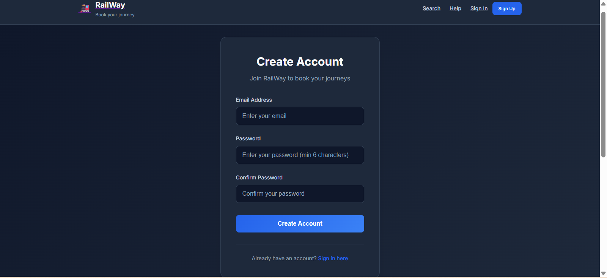
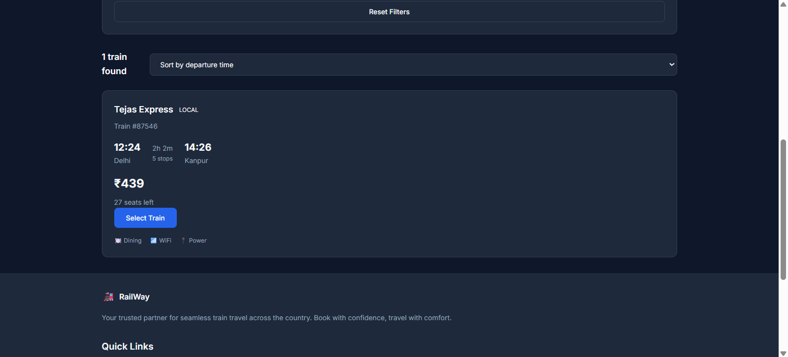
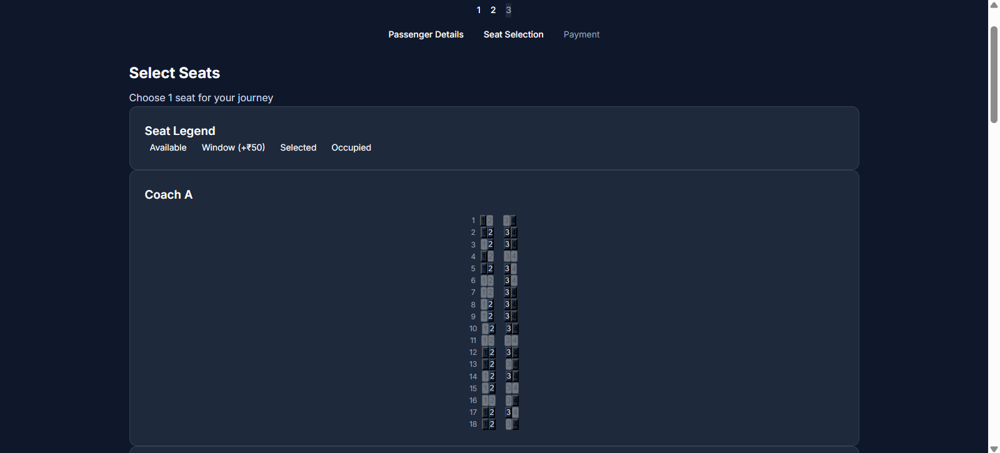
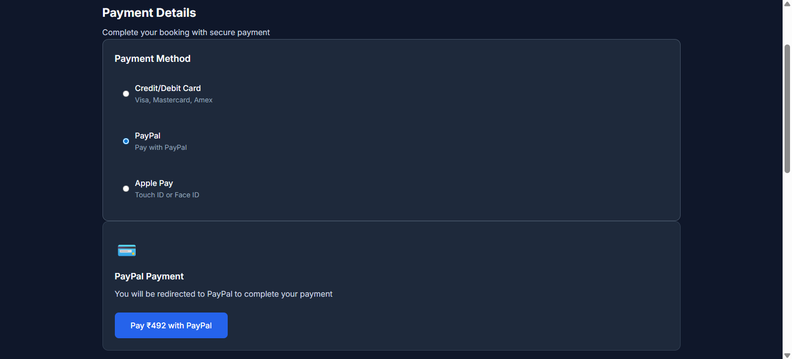
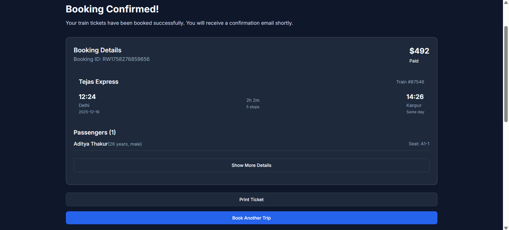

# 🚂 RailYatra - Indian Train Booking System

A modern, responsive train booking system built specifically for Indian Railways with React, Vite, and Firebase. This project demonstrates a complete booking flow from search to payment confirmation, featuring authentic Indian train stations and INR pricing.

## 🇮🇳 India-Focused Features

- **Authentic Indian Experience**: Real Indian train stations from Mumbai to Delhi, Bangalore to Chennai
- **INR Pricing**: All ticket prices displayed in Indian Rupees (₹) with realistic fare structures
- **Famous Indian Trains**: Book tickets on Rajdhani Express, Vande Bharat, Shatabdi Express, and more
- **Indian Railway Classes**: AC 1st, AC 2nd, AC 3rd, Sleeper, and General compartments
- **GST Integration**: 18% GST calculation as per Indian tax structure

## 🚀 Features

- **User Authentication**: Secure signup/login with Firebase Authentication (Email/Password)
- **Modern UI/UX**: Clean, professional design inspired by leading booking platforms
- **Responsive Design**: Works seamlessly on desktop, tablet, and mobile devices
- **Complete Booking Flow**: Search → Results → Booking → Payment → Confirmation
- **Real-time Search**: Dynamic train search between Indian cities with filtering and sorting
- **Interactive Seat Selection**: Visual seat map with different Indian Railway seat types
- **Secure Payment**: Multiple payment methods with comprehensive form validation
- **Route Protection**: Protected booking pages requiring user authentication
- **Firebase Integration**: Backend data persistence with Firestore and Authentication
- **Form Validation**: Comprehensive client-side validation throughout the app
- **Accessibility**: WCAG compliant with proper ARIA labels and keyboard navigation

## 🛠️ Tech Stack

- **Frontend**: React 18, Vite
- **Styling**: Vanilla CSS with CSS Custom Properties
- **Routing**: React Router DOM
- **Backend**: Firebase (Firestore Database, Authentication)
- **State Management**: React Context + useReducer
- **Authentication**: Firebase Auth with Email/Password
- **Date Handling**: date-fns
- **Build Tool**: Vite

## 📦 Setup & Installation

1. **Clone the repository:**
\`\`\`bash
git clone <repository-url>
cd train-booking-system
\`\`\`

2. **Install dependencies:**
\`\`\`bash
npm install
\`\`\`

3. **Set up Firebase:**
   - Create a new Firebase project at https://console.firebase.google.com
   - Enable **Authentication** and set up Email/Password provider
   - Enable **Firestore Database** in production mode
   - Copy your Firebase config and update `src/firebase/config.js`:
   
\`\`\`javascript
const firebaseConfig = {
  apiKey: "your-api-key",
  authDomain: "your-project.firebaseapp.com",
  projectId: "your-project-id",
  storageBucket: "your-project.appspot.com",
  messagingSenderId: "123456789",
  appId: "your-app-id"
};
\`\`\`

4. **Start the development server:**
\`\`\`bash
npm run dev
\`\`\`

5. **Open http://localhost:5173 in your browser**

## 📱 Usage

### Getting Started
1. **Sign Up**: Create a new account with email and password
2. **Login**: Access your account to start booking trains
3. **Search Trains**: Enter departure and destination cities (e.g., Mumbai to Delhi)
4. **Select Train**: Choose from available trains with different classes and timings
5. **Book Tickets**: Fill passenger details and select seats
6. **Make Payment**: Complete payment with card details
7. **Confirmation**: Receive booking confirmation with ticket details

### Authentication Flow
- **Protected Routes**: Booking pages require user authentication
- **Auto Redirect**: Users are redirected to login if not authenticated
- **User State**: Global user state management with React Context
- **Logout**: Easy logout functionality from the header

## 🏗️ Project Structure

\`\`\`
src/
├── components/          # Reusable UI components
│   ├── Header.jsx       # Navigation with auth state
│   ├── Footer.jsx
│   ├── SearchForm.jsx   # Train search with Indian cities
│   ├── TrainCard.jsx    # Train display with INR pricing
│   ├── PassengerForm.jsx
│   ├── SeatSelection.jsx # Indian Railway seat types
│   ├── PaymentForm.jsx  # Payment with INR
│   ├── BookingSummary.jsx
│   └── ProtectedRoute.jsx # Route protection
├── pages/              # Page components
│   ├── Home.jsx
│   ├── Login.jsx        # Firebase Auth login
│   ├── Signup.jsx       # Firebase Auth signup
│   ├── SearchResults.jsx
│   ├── BookingDetails.jsx
│   ├── Payment.jsx
│   └── Confirmation.jsx
├── context/            # React Context providers
│   ├── BookingContext.jsx
│   └── AuthContext.jsx  # Authentication state
├── firebase/           # Firebase configuration
│   └── config.js
├── services/           # API services
│   └── bookingService.js
├── utils/              # Utility functions
│   ├── mockData.js     # Indian train data
│   ├── validation.js
│   └── helpers.js      # INR formatting
├── hooks/              # Custom React hooks
│   ├── useLocalStorage.js
│   └── useAsync.js
├── App.jsx             # Main App with routing
├── main.jsx            # Entry point
├── index.css           # Global styles
└── auth.css            # Authentication styles
\`\`\`

## 🎨 Design System

The project uses a custom design system with:

- **Color Palette**: Professional dark theme with blue accents
- **Typography**: Inter font family with consistent sizing scale
- **Spacing**: 8px grid system for consistent layouts
- **Components**: Reusable button, input, and card components
- **Responsive**: Mobile-first approach with Indian user preferences
- **Indian Context**: Colors and styling appropriate for Indian users

## 📸 Screenshots

*Add screenshots of your application here:*
- 
- 
- 
- 
- 
- 

## 🔮 Future Enhancements

- **PNR Status Check**: Check booking status with PNR number
- **Train Running Status**: Live train tracking and delays
- **Multiple Payment Gateways**: Razorpay, Paytm, UPI integration
- **Offline Booking**: PWA capabilities for offline access
- **Multi-language Support**: Hindi and regional language support
- **IRCTC Integration**: Connect with official Indian Railway APIs
- **Tatkal Booking**: Fast booking for urgent travel
- **Food Ordering**: In-train meal booking integration

## 🚀 Deployment

1. **Build the project:**
\`\`\`bash
npm run build
\`\`\`

2. **Deploy to your preferred hosting platform:**
   - **Vercel**: `vercel --prod`
   - **Netlify**: Drag and drop the `dist` folder
   - **Firebase Hosting**: `firebase deploy`

## 🧪 Testing

The project includes comprehensive validation and error handling:

- Authentication form validation
- Booking form validation with Indian phone numbers
- Network error handling
- Loading states for better UX
- Accessibility testing with screen readers

**Built with ❤️.**

